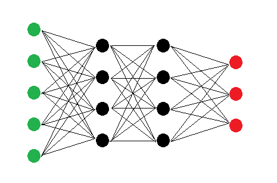

## Question 1: Logistic Regression
**Question 1.1:** Explain why Logistic Regression has the term "Regression" in it's name, even though it is a classification model.

The cost function for logistic regression is given as:
$$
J(\theta) = - \dfrac{1}{m} \sum_{i=1}^{m} y^{i} \log(h_\theta(x^{i})) + (1 - y^{i}) \log(1-h_\theta(x^{i}))
$$

**Question 1.2.1:** The logistic regression cost function is made up from two parts that are added together. Explain why one could say that for every input, only one of these parts is active.

**Question 1.2.2:** Describe what the error looks like for an active part.

**Question 1.3:** In Logistic Regression we use the sigmoid/logistic function: $g(z) = \frac{1}{1 + e^{-z}}$. Explain what this function does to its input, and why that is a desirable property.

**Question 1.4.1:** Explain what the decision boundary is for a classification model.

**Question 1.4.2:** Explain what the **optimal** decision boundary would look like for the dataset depicted above.

**Question 1.4.3:** Explain what the shape of a decision boundary generated by a Logistic Regression model would look like.

**Question 1.4.4:** If you have trained a Logistic Regression Model, how can you obtain the decision boundary?

## Question 2: Neural Networks

The image above displays a Neural Network. Input nodes are green, hidden nodes are black, and output nodes are red.

**Question 2.1:** Given the network displayed in the image above: Give the shape of all parameter matrices *and* vectors for each of the layers. Then list the total number of parameters in the network.

**Question 2.2:** How many input and output nodes would a Neural Network need to be able to predict the values of the column "origin" in the dataset displayed above?

**Question 2.3:** Explain why the addition of hidden layers to the Neural Network enables the Neural Network to model more complex datasets.

**Question 2.4:** The algorithm that is used to train a Neural Network is named backpropagation. Explain why backpropagation is a fitting name and "what" is propagated backwards.

## Question 3: Activations

**Question 3.1:** Explain the vanishing gradient problem.

**Question 3.2:** Give an advantage and a disadvantage of mini-batch gradient with respect to full-batch gradient descent.

**Question 3.3:** Given the graphs above, describe the possible problems for each of the learning curves.

## Question 4: Decision Trees

The image above shows the entropy and the GINI-value of a list with a specific ratio $p$ of `True` and `False` values. Both functions can be used to calculate the Information Gain of a specific split.

**Question 4.1:** For Decision Trees we use Information Gain to quantify the effectiveness of a specific split. In the notebook on Decision Trees we used entropy to calculate how "pure" a list of True and False values was based on their respective ratios. However, as we can see from the image above, we can use any function as long as it is symmetrical around a ratio of 0.5 and the highest value that the function returns is when the ratio is 0.5. Why is this the case?

**Question 4.2.1:** How can you use the information gain to determine what split to make for a categorical decision tree.

**Question 4.2.2:** Describe what the resulting branches of that categorical split would look like.

**Question 4.2.3:** What does the value upon which the first split is made tell you about the dataset.

**Question 4.3:** Suppose you have a Decision Tree for which you suspect that it overfits based on the validation score. Give three possible methods that you could use to change the tree, that will make overfitting less likely. Explain for each of the methods why it would work. **Note:** You are only allowed to make changes to the tree; you can not use a different model like a Random Forest.

## Question 5: The XOR problem

**Question 5:** Given the dataset above with two different classes: class A, and class B. Explain for Logistic Regression, Neural Networks, and Decision trees whether it is possible to train a model that can correctly classify _all_ datapoints.
