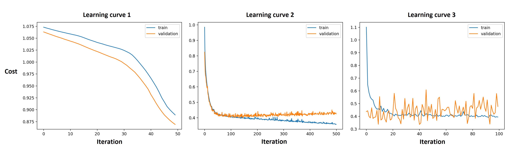

## Question 1: Logistic Regression

Logistic Regression is actually a model used for classification

**Question 1.1.1:** Explain how Logistic Regression learns a classification output.

**Question 1.1.2:** Explain why Logistic Regression is still called a regression model.

 

The cost function for logistic regression is given as:
$$
J(\theta) = - \dfrac{1}{m} \sum_{i=1}^{m} y^{i} \log(h_\theta(x^{i})) + (1 - y^{i}) \log(1-h_\theta(x^{i}))
$$

**Question 1.2.1:** The logistic regression cost function is made up of *two
separate parts* for each sample, that are added together. Explain why one
could say that for every sample, only one of these parts is active.

**Question 1.2.2:** Describe what the error approximately looks like for an active part, i.e. for what inputs is it high / low and how does it change.

 

**Question 1.3:** In Logistic Regression we use the sigmoid/logistic function: $g(z) = \frac{1}{1 + e^{-z}}$. Explain what this function does to its input, and why that is a desirable property for logisitic regresion.

 

{: width="60%"}

**Question 1.4.1:** Explain what the decision boundary is for a classification model.

**Question 1.4.2:** Explain what the **optimal** decision boundary would look like for the dataset depicted above.

**Question 1.4.3:** Explain what the shape of a decision boundary generated by a Logistic Regression model, using only $x_1$ and $x_2$ as input, would look like.

**Question 1.4.4:** Starting with a trained a Logistic Regression model, how can you obtain or determine the decision boundary of that model?

## Question 2: Neural Networks

The image above displays a Neural Network. Input nodes are green, hidden nodes are black, and output nodes are red.

**Question 2.1.1:** Given the network displayed in the image above: Give the shape of all parameter matrices *and* vectors separately for each of the layers.

**Question 2.1.2:** What is the total number of learnable parameters in this network?

 

**Question 2.2:** Say you're trying to train a Neural Network on the data set above. How many input and output nodes would that Neural Network need to be able to predict the values of the column "origin" in that dataset?

**Question 2.3:** Explain why the addition of hidden layers to the Neural Network enables the Neural Network to model more complex datasets.

**Question 2.4:** The algorithm that is used to train a Neural Network is named backpropagation. Explain what exactly is propagated backwards and how that enables the network to learn.

## Question 3: Activations

**Question 3.1:** Explain the vanishing gradient problem and why it makes it difficult for networks with many layers to learn the correct weights.

**Question 3.2:** Give an advantage and a disadvantage of mini-batch gradient with respect to full-batch gradient descent.

 

Below are 3 learning curves, where training and validation cost of a neural network are measured *during* the training phase. On the *x*-axis are the iterations of gradient descent and on the *y*-axis shows the cost. After each step of gradient descent, not only is the training error measured, but also the validation error.

**Question 3.3:** Each of these 3 curves shows that the network has not reached an optimal solution. For each of the 3 learning curves above, descibe: 

* What possible the problem with the neural network or training process could be,

* how this can be deduced from the graph,

* and what a possible solution might be.

## Question 4: Decision Trees

The image above shows the *entropy* and the *GINI-value* of a list with a specific ratio $p$ of `True` and `False` values. Both functions can be used to calculate the Information Gain of a specific split.

**Question 4.1:** In Decision Trees we use Information Gain to quantify the
effectiveness of a specific split. In the assignment we used entropy to
calculate how "pure" a list of True and False values was based on their ratio.
However, we can actually use any function as long as:

* It is symmetrical around a ratio of 0.5,
* and the highest value that the function returns is when the ratio is 0.5. 

Explain why these two criteria are necessary for a good measure of the "purity"
of a ratio.

**Question 4.2.1:** Explain how you use the information gain to determine what split to make for a categorical decision tree.

**Question 4.2.2:** Describe what the resulting branches of a split
look like for some split on a specific categorical feature.

**Question 4.2.3:** What does the feature that is used for the *first split* in
a decision tree tell you about the dataset.

 

**Question 4.3:** Suppose you have a Decision Tree for which you suspect that it overfits based on the validation score. Give three possible methods that you could use to change the tree, that will make overfitting less likely. Explain for each of the methods why it would work. **Note:** You are only allowed to make changes to the tree; you can not use a different model like a Random Forest.

## Question 5: The XOR problem

{: width="60%"}

**Question 5:** Given the dataset above with two different classes: class A,
and class B. For each of the following models

1. Logistic Regression

2. Neural Networks

3. Decision trees

Explain whether or it is possible to train a model that can correctly classify
_all_ points in the data set. Motivate your answers.
