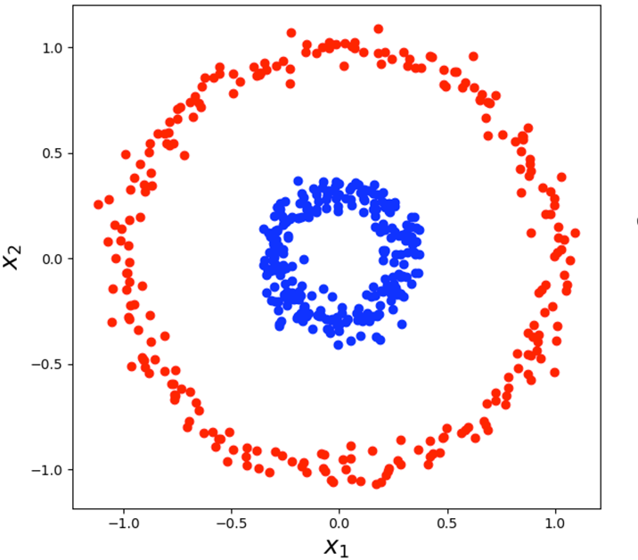
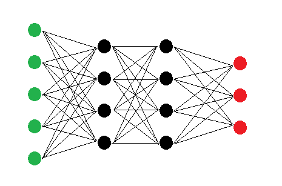
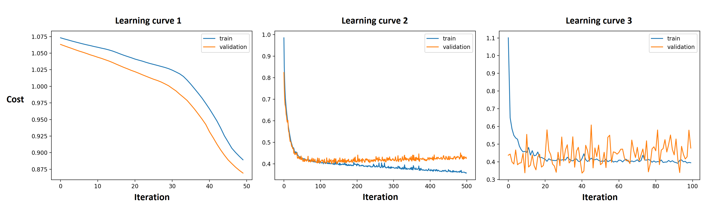
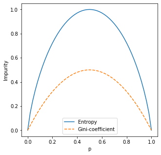
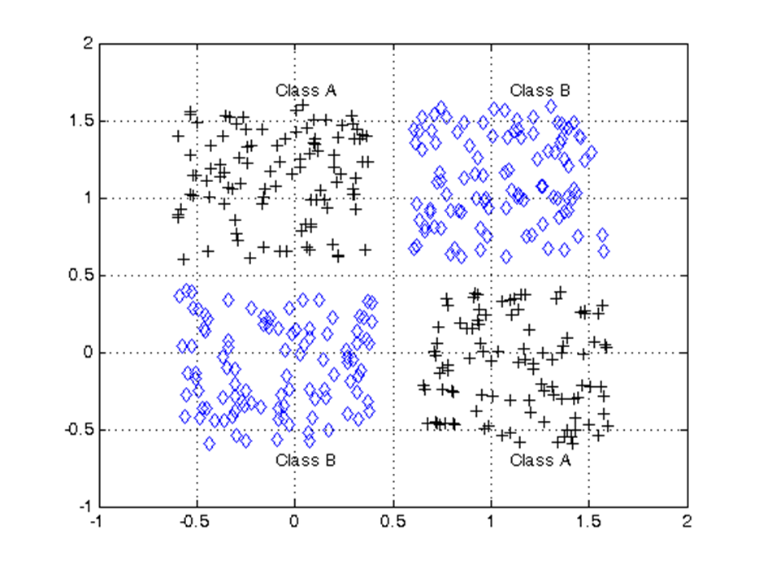

## Question 1: Logistic Regression

Logistic Regression is actually a model used for classification.

**Question 1.1.1:** Explain how Logistic Regression learns a classification output.

**Question 1.1.2:** Explain why Logistic Regression is still called a regression model.

 

**Question 1.2:** In Logistic Regression we use the Sigmoid/Logistic function: $g(z) = \frac{1}{1 + e^{-z}}$. Explain what this function does to its input, and why that is a desirable property for logisitic regresion.

 

The cost function for logistic regression is given as:

$$
J(\theta) = - \dfrac{1}{m} \sum_{i=1}^{m} y^{i} \log(h_\theta(x^{i})) + (1 - y^{i}) \log(1-h_\theta(x^{i}))
$$

**Question 1.3.1:** The logistic regression cost function is made up of *two
separate parts* for each sample, that are added together. Explain why one
could say that for every sample, only one of these parts is active.

**Question 1.3.2:** Describe what the cost approximately looks like for an
active part, i.e. for what inputs is it high / low and how does it change. Why
does that make it an effective classification cost function?

 

Consider the classification dataset plotted below.

{: width="60%"}

**Question 1.4.1:** Explain what the decision boundary for a classification
model is.

**Question 1.4.2:** Explain what the shape of a decision boundary generated by
a Logistic Regression model trained on this dataset, using only $x_1$ and $x_2$
as inputs, would approximately look like.

**Question 1.4.3:** Starting with a trained Logistic Regression model, how could
you obtain or determine the exact decision boundary of that model?

## Question 2: Neural Networks

The image above displays a Neural Network. Input nodes are green, hidden nodes are black, and output nodes are red.

**Question 2.1.1:** For the Neural Network displayed above: Give the dimensions
of all *matrix and vector* parameters defining each layer. List the
dimensions separately for each of the layers.

**Question 2.1.2:** What is the total number of learnable parameters in this network?

 

Consider the following dataset:

**Question 2.2:** Say you're trying to train a Neural Network to predict the
values of the column **origin** in the dataset above. How many *input nodes*
and *output nodes* would you use for that Neural Network? Explain your answers.

**Question 2.3:** Explain why the addition of hidden layers to the Neural Network enables the Neural Network to model more complex datasets.

**Question 2.4:** The algorithm that is used to train a Neural Network is named backpropagation. Explain what exactly is propagated backwards and how that enables the network to learn.

## Question 3: Activations

**Question 3.1:** Explain what the vanishing gradient problem is and why it makes it difficult for networks with many layers to learn the correct weights.

**Question 3.2:** Give an advantage and a disadvantage of mini-batch gradient with respect to full-batch gradient descent.

 

Below are 3 learning curves, where training and validation cost of a neural network are measured *during* the training phase. On the *x*-axis are the iterations of gradient descent and the *y*-axis shows the cost. After each step of gradient descent, not only is the training error measured, but also the validation error.

**Question 3.3:** Each of these 3 curves shows that the network has not reached an optimal solution. For each of the 3 learning curves above, descibe:

* What the problem with the neural network or training process could possibly be,

* how this can be deduced from the graph,

* and what a possible solution might be.

## Question 4: Decision Trees

**Question 4.1.1:** Describe what the branches of a categorical feature split
in a decision tree look like. How is the number of branches
determined and what does each of the branches correspond to?

**Question 4.1.2:** Explain how you can use the information gain to determine
what split to make for a categorical decision tree. Why is that an effective
way to determine what split to make next?

**Question 4.1.3:** What does the feature that is used for the *first split* in
a decision tree tell you about the dataset you've trained the decision tree on?

 

**Question 4.2:** Suppose you have a Decision Tree, which you think might be 
overfitting based on the validation score. Describe **3 possible methods** that you
could use to change the tree, that will make overfitting less likely. For each
of these methods also explain why they would make overfitting less likely.

*Note:* You are only allowed to make changes to the tree or the algorithm; you can not use a completely different model like a Random Forest.

 

The image above below shows the *Entropy* and the *Gini-coefficient* of a specific ratio $p$ between two class labels. Both functions can be used to calculate the Information Gain of a specific split.

**Question 4.3:** In the programmign assignment we used Entropy as a part
of the Information Gain to calculate how "pure" a list of class labels
in a specific split was based on their ratio. However, we can actually use any function as part of
the IG, as long as:

* It is symmetrical around a ratio of 0.5,
* and the highest value is at a ratio of 0.5.

Both the Entropy and the Gini-coefficient clearly meet these criteria. Explain
why these two criteria are actually necessary for a good measure of the "purity"
of a class label ratio.

## Question 5: Model selection

{: width="60%"}

**Question 5:** Given the dataset above with two different classes: class A,
and class B. For each of the following models:

1. Logistic Regression

2. Neural Networks

3. Decision trees

Explain whether or not it is possible to train the model to correctly classify
_all_ points in the dataset. Motivate your answers for each of the models
separately.
